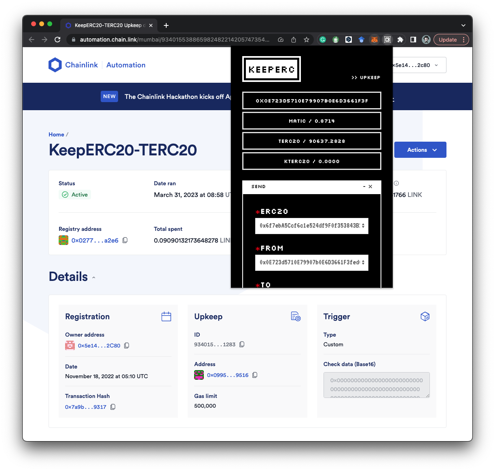

# 🄺 Chrome Extension

The KeeperC Chrome Extension provides a user-friendly interface to interact with the KeeperC protocol on the Mumbai-Polygon Testnet. Follow these steps to use it:

1. Download the KeeperC Chrome Extension from the [GitHub](https://github.com/KeepERC20/KeepERC20-frontend/tree/extension) repository (not available on the Chrome Web Store yet).
2. Get test tokens by clicking the `FAUCET / 0x1234 ...` button.
3. Use the **Scheduled Transfer**, **Recoverable Transfer**, or **Expirable Approve** functions as per your requirement.

Note that **Approve** is required for **Scheduled Transfer** and **Recoverable Transfer**.
Check your transaction histories on the **TASKS** window.

That's it!
