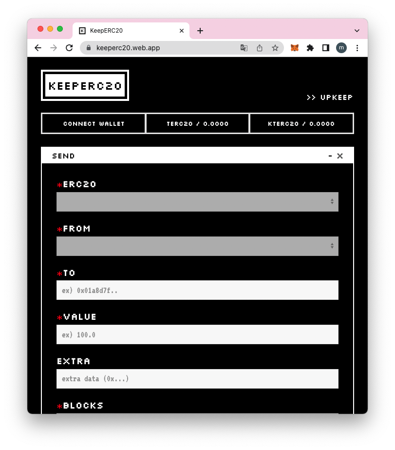

# 🇰 KeepERC20-frontend
Frontend of [KeepERC20](https://keeperc20.web.app/).

1. Connect wallet (Mumbai Chain)
2. Get test token by faucet (TERC20 / 100)
3. Use Scheduled Transfer, Recoverable Transfer, Expirable Approve

* `Approve` required for Scheduled Transfer and Recoverable Transfer
* Check your histories on `TASKS` window

