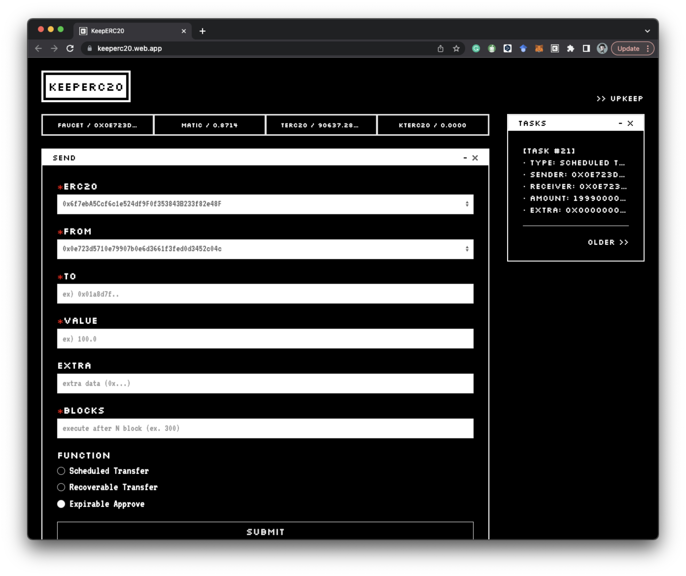

# Web App

You can access the KeeperC web app at [https://keeperc20.web.app/](https://keeperc20.web.app/). Follow these steps to use it:

1. Connect your wallet using Metamask on the Mumbai - Polygon Testnet.
2. Get test tokens by clicking the `FAUCET / 0x1234 ...` button.
3. Use the **Scheduled Transfer**, **Recoverable Transfer**, or **Expirable Approve** functions as per your requirement.

Note that **Approve** is required for **Scheduled Transfer** and **Recoverable Transfer**.
Check your transaction histories on the **TASKS** window.

That's it! You're ready to use KeeperC to manage your transactions on the Mumbai - Polygon Testnet.
