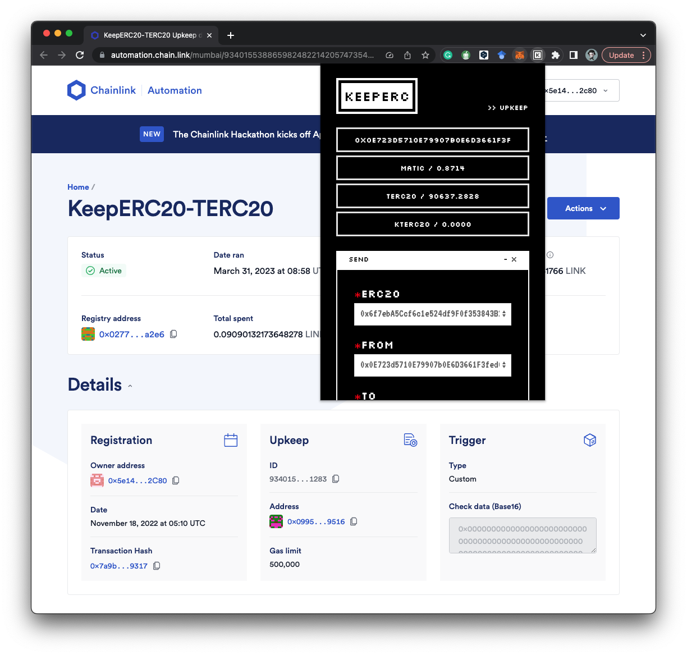

# 🄺 Chrome Extension

The KeeperC Chrome Extension provides a user-friendly interface to interact with the KeeperC protocol.
Follow these steps to use it:

1. Download the KeeperC Chrome Extension from the [GitHub](https://github.com/KeepERC20/KeepERC20-frontend/tree/extension) repository (not available on the Chrome Web Store yet).
2. Run `$ npm run build` to update the `dist` folder, then navigate to (Extensions)[chrome://extensions/] and click on `Load unpacked` to import the updated `dist` folder. You'll need to enable Developer mode first.
3. Get test tokens by clicking the `FAUCET / 0x1234 ...` button.
4. Use the **Scheduled Transfer**, **Recoverable Transfer**, or **Expirable Approve** functions as per your requirement.

---

Note that **Approve** is required for the first time usage. Check your transaction histories in the `TASKS` window.

That's it! You're now ready to use KeeperC to manage your ERC20s safe.
