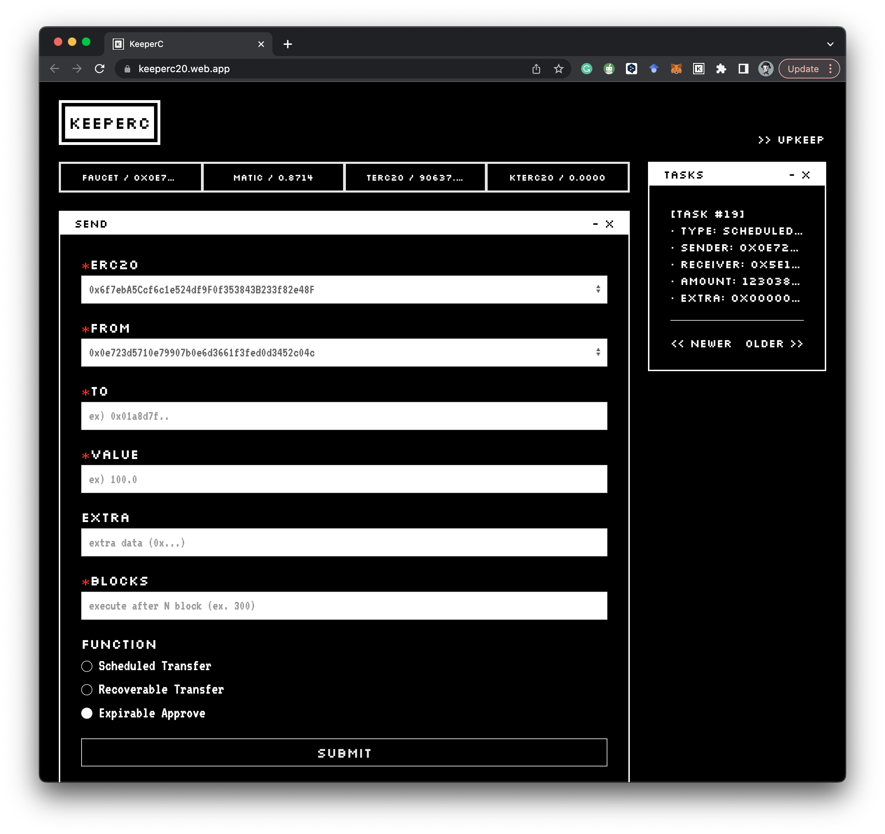

# 🄺 Web App

You can access the KeeperC [web app](https://keeperc20.web.app/).
Follow these steps to use it:

1. Connect your wallet using Metamask on the Mumbai - Polygon Testnet.
2. Get test tokens by clicking the `FAUCET / 0x1234 ...` button.
3. Use the **Scheduled Transfer**, **Recoverable Transfer**, or **Expirable Approve** functions according to your requirements.

---

Note that **Approve** is required for the first time usage. Check your transaction histories in the `TASKS` window.

That's it! You're now ready to use KeeperC to manage your ERC20s safe.
